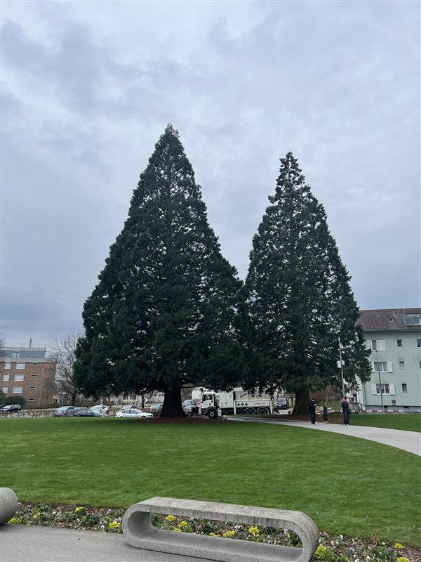
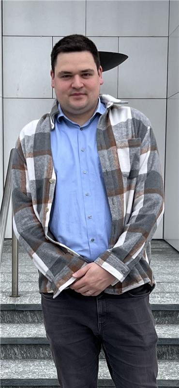
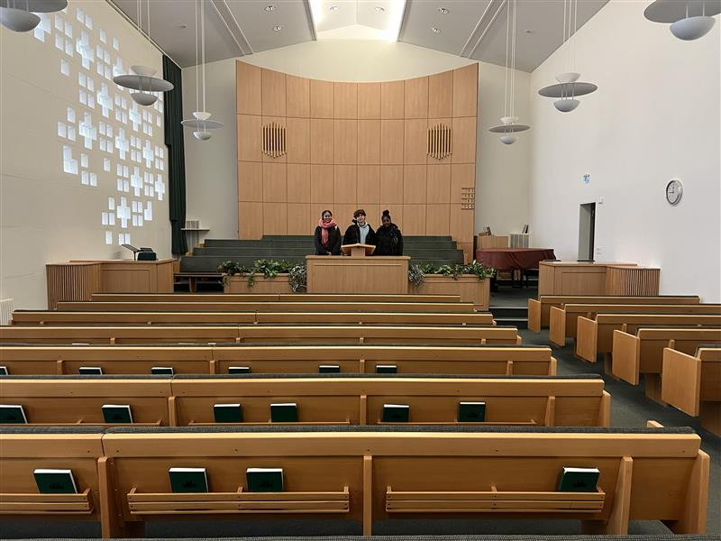
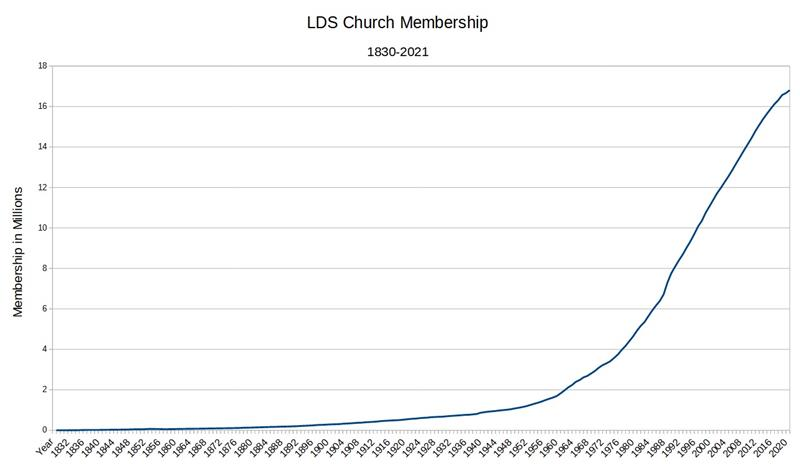

+++
title = "„Für unreine Personen ist der Zutritt verboten“"
date = "2024-02-22"
draft = false
pinned = false
image = "e52b9839-55ad-4288-925b-a1f372bc38ac.jpg"
+++
## Ein Bischof der Kirche Jesu Christi der Heiligen der Letzten Tage berichtet über seine Religion und ihre einzigartige Originalität. 

Eine Reportage von Davina, Kimi und Owen. 

 **Der Gründer der Mormonen**\
Am 23. Dezember 1805 erblickte in Sharon/Vermont der Amerikaner Joseph Smith das Licht der Welt. Er war das vierte von neun Kindern des Ehepaares Lucy (geb. Mack) und Joseph Smith sen. Während eines Gebetes in einem Wäldchen am Rande seines Wohnortes Manchester/N.Y. seien ihm in einer Vision »Gott der Vater«, einem Engel und »Jesus Christus« erschienen. »Gott« habe ihm geraten, sich keiner der bestehenden Kirchen anzuschließen, da sie sich alle im Irrtum« befänden und ihre Bekenntnisse »ein Greuel in seinen Augen« seien. Er hat dadurch die goldene Bibel erhalten, 1830 hat er mit dieser Quelle das Buch Mormon verfasst.  

An einem Dienstagmorgen entfaltet sich ein eher ungewöhnliches Spektakel. Haarscharf geschnittenes Gras wächst hier auf grossen Wiesen. Die Halme sind noch mit Tau vom kühlen letzten Abend bedeckt. Symmetrische Blumenbeete bringen Farbe in die ansonsten eintönige Umgebung. Grosse Bäume bewachen den Eingang vom Tempelplatz. Im Zentrum steht der Hauptanblick: Der Tempel der Kirche Jesu Christi der Heiligen der letzten Tage. In Essenz ein grosses graues Gebäude mit einer goldenen Figur auf dem Haupte. Versucht man in den Tempel zu gehen, so wird man von Französisch sprechenden Kirchmitgliedern angehalten, alle teuer gekleidet in weissen Anzügen und Trachten. Unreine dürfen nämlich nicht das Innere des grossen Tempels betrachten, es ist verboten. 

Ein steinerner Pfad führt in das gewöhnlich aussehende Gemeindehaus. Darin befindet sich eine Sonntagschule. An allen Wänden hängen Porträts des heiligen Jesus Christus, in denen er an verschiedenen biblischen Ereignissen teilnimmt. Jedoch ist die Stimmung auf keinen Fall düster oder unfreundlich. Dies scheint im Büro des Bischofs noch mehr der Fall zu sein.  
Zu sehen sind ein Regal gefüllt mit Bibeln, eine griechische Vase und ein modernes Kunstwerk in der rechten Hälfte des Zimmers. Der große Schreibtisch bietet genug Platz für eine Diskussion. 

Der 34-jährige **Simon Abplanalp**, der nicht nur Mitglied dieser Gemeinde, sondern auch ihr Bischof ist, leitet den Besuch. Er ist Vater von zwei kleinen Kindern, 6 und 8 Jahre alt, hat einen festen Platz in der Gemeinde und ist ein angesehener Mann.  




### “Es gibt nicht eine Wahl oder irgendetwas, bei dem man sich bewirbt, Bischof zu werden, ist wie eine Berufung.” 

Bischöfe in der Kirche Jesu Christi der Heiligen der letzten Tage müssen nicht Jahre lang der Kirche gedient haben, um ihre Position zu erhalten. Die einzigen Voraussetzungen sind, dass die Person verheiratet ist, Arbeit hat und sich bemüht, ein würdiges Leben zu führen. <!--StartFragment-->

Es gibt mehrere Gründe dafür. Simon erläutert: „Als Bischof hat man auch die Verantwortung zu schauen, dass es den Personen finanziell gut geht.“ Besonders die Arbeit ist wichtig. Wenn der Bischof keine Arbeit hat und es ihm oder ihr finanziell schlecht geht, jedoch sie die Verantwortung über das Geld der Kirche und der Gemeinde haben, kann dies die Lage verkomplizieren. Darum haben sie als Voraussetzung, dass sie eine Arbeitsstelle haben müssen, zudem muss man auch würdig sein. 

 

Aber was denn soll “würdig” genau heissen? Im Mormonentum gibt es viele Regeln, die befolgt werden müssen, damit man als ‘rein’ gilt. Zum einen gibt es gewöhnliche Regeln wie die Taufe. Jedoch gibt es auch besondere Regeln, zum Beispiel sind der Konsum von Kaffee oder Tee verboten, genau wie Alkohol auch.  Wer sich daran hält, wird nebst Gesundheit auch Schutz, Erkenntnis und Weisheit versprochen.  Es scheint kein Tabu zu sein, wenn jemand beim Konsum dieser Substanzen erwischt wird. Jedoch kann dies je nach Person variieren. Jedes muss eigentlich selbst wissen, was für es richtig ist. Sie glauben daran, dass jeder die Möglichkeit hat, auch persönliche Offenbarung vom himmlischen Partner zu bekommen und die kann man selbst finden. Der Glauben ist ausschliesslich, dass zum Beispiel Tee eine Substanz ist, die abhängig oder süchtig macht. Wenn Mormonen aber abhängig sind, sei es von Alkohol, sei es Tabak, aber auch eben Kaffee, dann besteht stark der Glauben, sie hätten ihre Freiheit verloren. Jeder trifft seine eigenen Entscheidungen. Es wird aber zum Beispiel nicht am Sonntag kontrolliert, wer jetzt genau nach Tabakrauch riecht. Grundsätzlich geht es um die Entscheidungsfreiheit, damit die Kontrolle über den eigenen Körper besteht, ist es besser, nicht abhängig zu sein.  

### „Denken Sie, es gebe heutzutage noch Propheten und dadurch die Chance der Entstehung eines dritten Testaments?“ 

Darauf antwortet der Bischof, dass das, woran Mormonen sicher glauben, sei, dass Mormonen nach wie vor Offenbarung für die ganze Kirche erhalten und, dass jeder persönlich Offenbarung erhalten könne. Er behauptetet, er habe selber einmal durch das Beten Offenbarung für seine Familie bekommen. Ob das dritte Testament in Form eines Buches erscheinen werde, wie im Fall des damals 14-jährigen Joseph Smith, wisse er nicht.  

Joseph Smith war sowohl der Gründer des Mormonentums, des Latter Day Saint Movement als auch der erste Präsident der Kirche Jesu Christi der Heiligen der letzten Tage. Er wurde in Sharon, Vermont geboren und zog mit seiner Familie in den Westen New Yorks. Wie Bischof Abplanalp meint, habe Joseph Smith als Jugendlicher durch eine Reihe von Visionen von Jesus, Gott und einem Engel namens Moroni Offenbarung und dadurch Zugriff auf die goldene Bibel erhalten, woraufhin er 1830 mit dieser Quelle das Buch „Mormon“ verfasst habe. Er gewann eine grosse Menge an Anhängern bis er 1840 aufgrund seiner Ermordung seine Position als Präsident der Kirche verlor. Wer die Positions des Nachfolgers bekam, bleibt bis heute umstritten. 

### „Heisst es, dass mormonische Frauen durch die Polygamie eine tiefere Stellung als Männer haben?“ 

Simon erklärt, ein Stereotyp, das oft mit den Mormonen verbunden wird, ist dass Frauen eine tiefere Stellung als Männer haben, (was jedoch nicht stimmt) da früher männliche Mormonen in den USA mehrere Frauen haben durften. Sie hatten andere Aufgaben, seien aber gleichwertig. Das Stereotyp entstand, als in früheren Jahren Mormonen in den USA oftmals Polygamie betrieben, wobei ein Mann mehrere Frauen haben konnte. Die Polygamie hatte aber auch einen spezifischen Grund. Der Bischof erklärte es so. 

 

Europäische Immigranten in den USA wollten sich der Kirche anschliessen, jedoch war die Kirche auf der Flucht, da sie verteufelt wurde und sie nirgends willkommen waren. Die Leute dachten, der Prophet, Joseph Smith selbst, sei verrückt. Auf der Flucht durch die amerikanische Prärie oft angegriffen von Banditen, verhungert oder verdurstet etc. sind viele von ihnen gestorben. Am Schluss sind sie im Salzseetal, wo jetzt Salt Lake City ist, angekommen. Es gab viele Frauen, die keinen Mann mehr hatten, da er auf der Reise starb.  Es wurde also so organisiert, damit die Frauen nicht allein waren, dass sie zu einer Familie gehörten, deswegen haben bereits verheiratete Männer geheiratet. Heutzutage ist die Polygamie in den Vereinigten Staaten verboten, weswegen die meisten Mormonen weltweit diese Praxis nicht mehr betreiben. Polygamie wird noch mit einer Gefängnisstrafe von bis zu fünf Jahren geahndet.

> “Wir sind die einzige mormonische Kirche in der Schweiz” 
>
> *\-Simon Abplanalp*

Ausführlich erklärt er, dass ihre Gemeinde die einzige mormonische Kirche in der Schweiz ist, was bedeutet, dass sie eine besondere Verantwortung haben, sicherzustellen, dass alle Mormonen die Möglichkeit haben, an den Gottesdiensten teilzunehmen. Um dies zu gewährleisten, bieten sie Unterkünfte direkt neben der Kirche an, die kostenfrei sind. Diese Unterkünfte sind besonders für diejenigen gedacht, die eine weite Anreise haben, damit sie nicht bereits um 4 Uhr morgens losfahren müssen. Aufgrund der Vielzahl von Menschen, die aus dem Ausland kommen, sei es aufgrund von Versetzungen oder aus anderen Gründen, organisieren sie regelmässig verschiedene Events, um die Gemeinschaft zu stärken. Herr Abplanalp überreicht uns einen Flyer für ein internationales Essen, zu dem wir herzlich eingeladen wurden. Dabei handelt es sich um eine Gelegenheit, mit Menschen aus den USA, Mexiko, Kuba und anderen Ländern in Kontakt zu treten und kulturelle Vielfalt zu erleben. 

### “Es gibt ein Leben nach dem Tod, wo wir zurück zum himmlischen Vater kommen.” 

Bischof Abplanalp sagt, der Name “Mormonen” sei nur ein Übername und dass seine Kirche als “Kirche Jesu Christi der Heiligen der letzten Tage” (die Kirche, in der er seine Profession betreibt) bezeichnet werden solle.  Der Übername “Mormonen” kommt von dem Prophet Mormon, einem von den Autoren des Buches Mormon war. Das Buch Mormon ist im Mormonentum ein weiterer Zeuge für Jesus Christus. Abgeleitet von dem bekamen die Glaubenden diesen Spitznamen. Anschliessend gibt er Preis, dass sie 13 Glaubensartikel haben. Im Kern ihres Glaubens seien Jesus Christus zusammen mit seiner Auferstehung, seinem Sündopfer und dem Fakt, dass es ein Leben nach dem Tod gebe, wo sie zurück zu Jesus und ihrem himmlischen Vater gehen.

Die gläubigen Mormonen aus Zollikofen sind nicht selten und schon garnicht die Einzigen. Es gibt nämlich insgesamt 350 verschiedene Standorte der Kirche von Ländern A bis Z weltweit auf allen Kontinenten verbreitet, wobei der Hauptsitz, Church of Jesus Christ of Latter-Day Saints, in Salt Lake City, Utah in den USA ist.  

Die Kirche Jesu Christi hat laut ihrer Website seit Dezember 2023 über 17 Millionen an Mitgliedern gewonnen 

>  "Keiner sieht die Kirche Jesu Christi HLT als eine Christliche Kirche an"
>
> *\-Sladkovic Dr.Theol.*

In einem zweiten Interview mit Angela Büchel **Sladkovic, Dr. theol.**, welche Mitglied der Kirche im Haus der Religionen Bern ist, wurde uns Information über die Mormonen im Zusammenhang mit der christlichen Gemeinschaft preisgegeben. Sie erklärt, dass es von den in der Ökumene verbundenen Kirchen weltweit keine gebe, die die Kirche Jesu Christi HLT als christliche Kirche anerkennt. Sie fügt zu, dass dies jedoch keine Zusammenarbeit zwischen ihnen und den Mormonen ausschliesse und, dass diese Zusammenarbeit im interreligiösen Feld stattfinde. 

Die Mormonen glauben an die Bibel wie alle anderen Christen. Was sie aber unterscheidet ist, dass für sie nicht nur Jesus ein Mensch ist der Gott ist, sondern auch der Vater (Gott im Christentum) einmal Mensch gewesen ist. Was sie auch noch unterscheidet, ist, dass sie einen weiteren Propheten, Joseph Smith, in der Bibel haben. Ausserdem glauben Mormonen auch, dass jeder Mensch theoretisch durch Erleuchtung „göttlich“ werden können. Das kann auch dazu beitragen, dass sie in höheren Mitgliedern Aposteln oder sogar Propheten sehen können. Diese sind die Kernunterschiede zwischen dem christlichen und dem mormonischen Glauben. Ein weiterer potenzieller Grund für die Abgrenzung der Christen und der Mormonen könnte ihr kontroverser Glaube sein. Es gab damals eine Unstimmigkeit zwischen Mormonen und Christen, weshalb sie am Anfang ihrer Zeit wegen ihres Glaubens verfolgt und ermordet wurden.  

